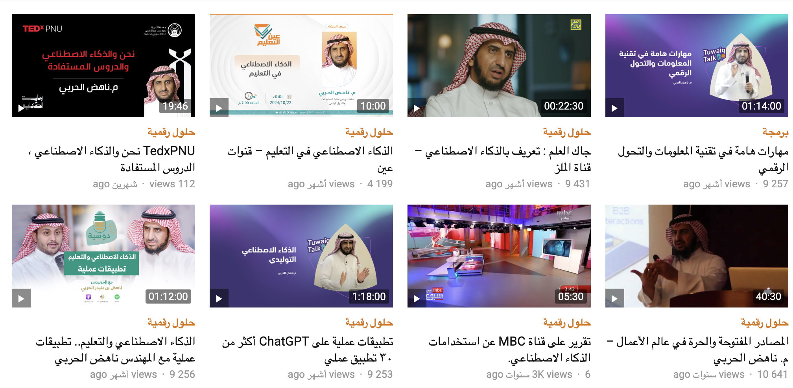

# MyWPTube

قالب WordPress مصمم على غرار YouTube، يدعم اللغة العربية والاتجاه من اليمين لليسار (RTL).

## المميزات

- تصميم يشبه YouTube
- دعم كامل للغة العربية والاتجاه RTL
- عرض مقاطع الفيديو في شبكة متجاوبة
- دعم المقاطع المميزة في الصفحة الرئيسية
- نظام تصنيف متقدم
- شريط علوي متكامل مع:
  - شعار الموقع
  - حقل بحث
  - روابط التواصل الاجتماعي
- تصميم متجاوب يعمل على جميع الأجهزة
- دعم مدة الفيديو
- نظام ترقيم بسيط وفعال

## المتطلبات

- WordPress 5.0 أو أحدث
- PHP 7.4 أو أحدث
- MySQL 5.6 أو أحدث

## التثبيت

1. قم بتحميل القالب
2. قم بتحميل القالب إلى مجلد `wp-content/themes/`
3. قم بتنشيط القالب من لوحة التحكم في WordPress

## التخصيص

### إعدادات القالب

1. **الشعار**: قم بتحميل شعار الموقع من خلال `المظهر > تخصيص > شعار الموقع`
2. **وصف الموقع**: قم بإضافة وصف للموقع من خلال `الإعدادات > عام`
3. **المقاطع المميزة**: قم بتثبيت المقاطع التي تريد عرضها في الصفحة الرئيسية

### حقول مخصصة

- `video_duration`: مدة الفيديو (بالدقائق)
- `video_views`: عدد المشاهدات
- `video_likes`: عدد الإعجابات

## الترخيص

هذا القالب مرخص تحت رخصة [GNU General Public License v2](http://www.gnu.org/licenses/gpl-2.0.html).

## الدعم

إذا واجهتك أي مشكلة أو لديك أي استفسار، يرجى فتح issue في هذا المستودع.

## المؤلف

تم تطوير القالب بواسطة [Nahedh AlHarbi](https://nahedh.com)

## الإصدار

الإصدار الحالي: 1.4 